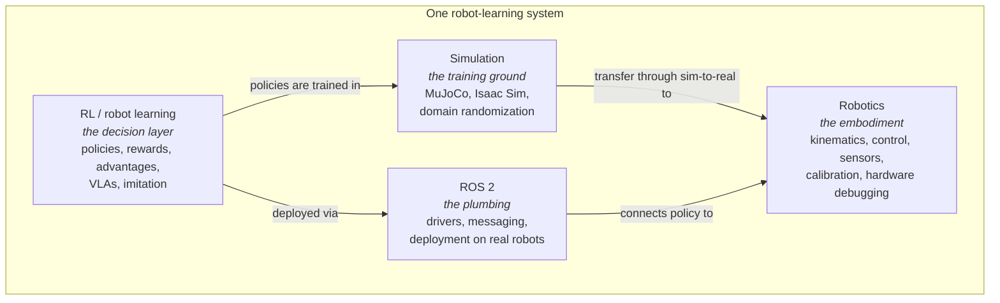

# Robotics + RL Engineering Roadmap

**Goal:** become employable as a robotics engineer specializing in robot learning (RL/IL on real hardware), in ~5–6 months at **15–20 h/week**.
**Capstone:** replicate the LeHome Challenge solution — first in simulation, then adapted to the real SO-101.
**Companion:** `textbook/` in this repo — *Reinforcement Learning for Real Robots* (2nd edition) — covers all the theory referenced below. Chapter numbers (Ch1–Ch15) refer to it; its **Appendix B (the experiment ladder)** gives one concrete experiment per chapter (E1–E12), each mapped to a phase below — the build hours in Phases 0–3 largely *are* those rungs.

---

## 1. Making sense of the fronts

You are learning four things at once. They are not four subjects — they are four **layers of one system**:

Consequences of this picture:

- **RL is the primary front.** It's the differentiator in the job market and the deepest theory. It gets the most hours.
- **Simulation is not a separate subject** — it's where RL training happens. You learn Isaac Sim *by doing LeHome*, not from tutorials in a vacuum.
- **ROS 2 is a background track.** ~2 h/week, always attached to a real need (rover-v1's RPLIDAR + Pi 4), never studied abstractly. Robotics employers expect working knowledge, not mastery.
- **Robotics fundamentals** (kinematics, control, calibration) you learn on contact with hardware — you're already doing this in `hil-serl` (servo buses, udev rules, camera pipelines *are* robotics engineering).

## 2. Where you actually are (honest audit, Aug 2026)

| Area | Evidence | Level |
|---|---|---|
| Classic deep RL (PPO, custom envs) | `rl-rover`: custom Gymnasium env, PPO/SB3, reward shaping, MuJoCo port, DR, solvability audits | **Solid practitioner** |
| Real-robot RL | `hil-serl`: full HIL-SERL actor/learner on a real SO-101, teleop, interventions, camera pipelines | **Rare and valuable** — most applicants have never done this |
| Sim-to-real | rover deployed to real hardware; DR discipline | Working knowledge |
| RL theory depth | REINFORCE→PPO understood operationally; offline RL, flow policies, VLAs not yet | **The gap** — this is what the textbook closes |
| Modern robot learning (VLAs, flow matching, AWR/RECAP) | Not yet | **The gap** |
| ROS 2 | Planned for rover-v1, not started | Beginner |
| Isaac Sim | Not yet | Beginner |

The plan below spends your hours on the two gaps, keeps the strengths warm, and converts everything into portfolio artifacts.

## 3. The phases

Assumes ~17 h/wk average. Weekly template: **~8 h build · ~5 h theory (textbook + papers) · ~2 h ROS 2 track · ~2 h writing/log**. Phases overlap deliberately.

### Phase 0 — Foundations consolidation (weeks 1–2)
*You know most of this operationally; make it explicit so interviews can't shake you.*

- Read **Ch1–Ch3** (MDPs, policy gradients, PPO, GAE). Do the worked examples by hand.
- Redo the GAE computation on real numbers from a rover training run (pull values from TensorBoard).
- **Gate to move on:** you can derive REINFORCE from the log-derivative trick on a whiteboard, and explain to an imaginary interviewer why PPO clips the ratio and what λ in GAE trades off.

### Phase 1 — Modern robot learning theory (weeks 2–6)
*The conceptual pivot: from "RL = PPO" to "RL = improving generative policies with advantages."*

- Read **Ch4–Ch10** — AWR/AWAC (Ch4), then the whole generative-policy arc: why Gaussians fail (Ch5), diffusion from zero (Ch6), flow matching (Ch7), VLAs (Ch8), **PPO vs. VLA-RL side by side (Ch9)**, RECAP (Ch10). This is the heart of the book and the longest stretch — budget most of Phase 1 for it.
- Watch Larchenko's Part 1 video again *after* Ch10 — it will read completely differently.
- Practical anchor: rungs E5 (diffusion) and E5b (flow matching) from Appendix B — train both on an existing LeRobot dataset and compare sample diversity and latency (no robot needed).
- Selected CS224R lectures (imitation, offline RL) as reinforcement, not as a course to complete.
- **Gate:** you can explain, unprompted, (a) why PPO can't train a flow-matching VLA, and (b) two ways around it (weighting = AWR, conditioning = RECAP).

### Phase 2 — LeHome in simulation: run, then baseline (weeks 5–10)
*Capstone Stage A + B. Simulation front onboards here, inside the project.*

- Clone the LeHome challenge env + Larchenko's solution. Get Isaac Sim running; run **his checkpoint** in the sim eval and reproduce a leaderboard-comparable score (Stage A).
- Map the codebase: write a 2-page architecture note in your own words (this doubles as portfolio).
- Fine-tune the base policy on provided demos, **BC only** — your honest baseline per garment type (Stage B).
- Read **Ch14** (async loop, domain randomization) alongside.
- **Gate:** a table of eval scores — his checkpoint vs. your BC baseline — produced by *your* eval runs.

### Phase 3 — LeHome RL loop (weeks 9–16)
*Capstone Stage C + D. The deepest technical stretch of the roadmap.*

- Read **Ch11–Ch12** (reward/advantage engineering, inference-time optimization) as you build.
- Add auxiliary heads; build checkpoint rewards from the success criteria; compute advantages (damped baseline + relative anchor); train with AWR weights + RECAP conditioning.
- Stand up the async rollout/train loop sized to your workstation (fewer workers, LoRA if needed).
- Then the cheap wins: CFG scale sweep, best-of-N, Thompson sampling over inference knobs.
- **Gate:** measurable improvement over the BC baseline, with an ablation note of what helped.

### Phase 4 — To the real robot (weeks 15–20)
*Capstone Stage E, folded into your existing HIL-SERL work.*

- Read **Ch13** (DAgger, HG-DAgger, HIL-SERL theory — the pipeline you already run).
- Finish the current `hil-serl` cube task to a clean success-rate result (it's one restart away — see its NEXT.md).
- The bimanual fork: LeHome needs two arms. Either acquire a second SO-101 pair, or adapt to a **single-arm garment task** (towel fold with a fixture) reusing the full machinery: teleop demos → sim alignment → real fine-tune → DAgger corrections.
- **Gate:** a video of the real SO-101 doing a garment task end-to-end, with success statistics over ≥20 trials.

### Phase 5 — Portfolio and job search (weeks 19–24, thread starts week ~12)
- Write-ups: one tech note per repo (rover sim-to-real; HIL-SERL reproduction; LeHome replication with per-stage numbers). Larchenko's career case study *is* the playbook: open-source + write + show videos.
- rover-v1 as the ROS 2 credential: RPLIDAR + ROS 2 nodes on the Pi 4, even a minimal version.
- Target roles: robot learning engineer, robotics software engineer (learning teams), applied research engineer. Interview prep maps directly to the textbook: policy gradients & PPO (Ch2–3), offline RL (Ch4), diffusion/flow/VLAs (Ch5–8), "why not PPO for a VLA?" (Ch9 — a common interview probe), practical debugging war stories (you have real ones).
- Start applying **before** Phase 4 finishes — the pipeline is long, and "in progress" capstones interview well.

## 4. ROS 2 background track (~2 h/week, weeks 3–20)

1. Weeks 3–6: core concepts on your machine — nodes, topics, `ros2` CLI, one Python publisher/subscriber. Use the official Humble/Jazzy tutorials, nothing more.
2. Weeks 7–12: rover-v1 bring-up — RPLIDAR C1 driver node on the Pi 4, teleop node, visualize scans in RViz.
3. Weeks 13–20: close the loop — run the trained rover policy as a ROS 2 node (the "offboard brain" from your knowledge base becomes a proper node graph).

## 5. Milestone summary

| Week | Milestone | Artifact |
|---|---|---|
| 2 | Foundations explicit | Hand-worked GAE on real run data |
| 6 | Modern theory pivot done | Diffusion + flow policies trained and compared (E5/E5b) |
| 10 | LeHome runs + BC baseline | Eval score table + architecture note |
| 16 | RL beats BC in sim | Ablation write-up |
| 20 | Real-robot garment task | Video + success stats |
| 24 | Job-ready portfolio | 3 tech notes, applications out |

## 6. Rules of the road

- **Build first, read to unblock.** Theory hours serve the current build phase; the textbook is ordered so this works.
- **Every phase ends in an artifact with a number on it.** No "I studied X" milestones.
- **Don't parallelize fronts within a session.** A session is either build, theory, or ROS 2.
- **Log as you go** (you already do this well — `NEXT.md`-style). The logs become the tech notes.
- **Timebox sim purgatory.** If Stage C stalls >2 weeks without progress, ship what works and move to the real robot — Phase 4 is the differentiator, not leaderboard parity.
